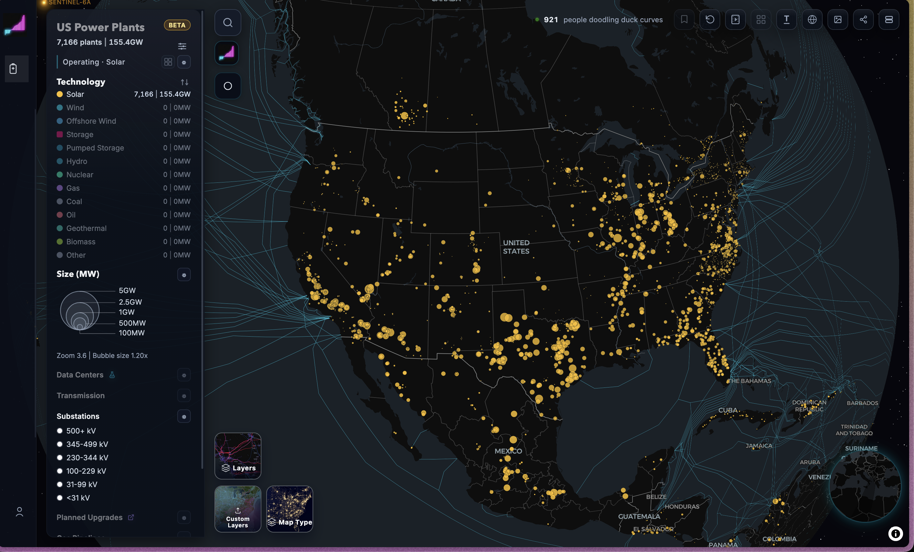
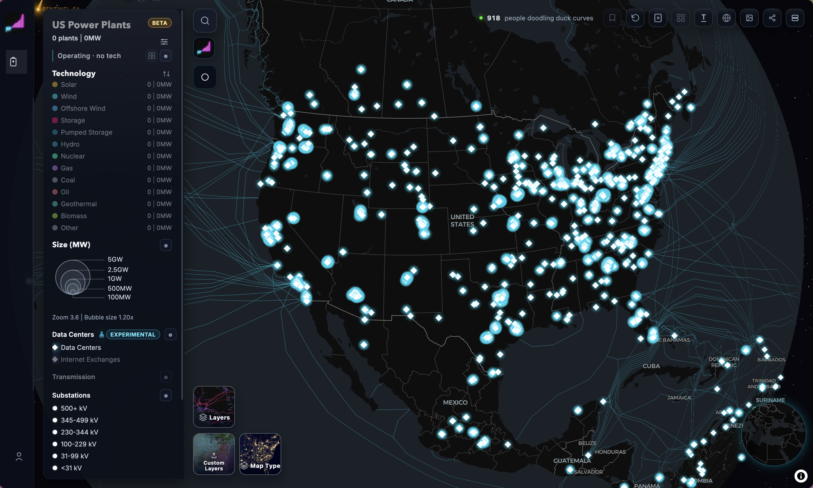

# VisInTheWild

## Introduction
The website we focused on was https://opengridworks.com.

## What is the purpose of this visualization?
The purpose of this website is to show energy infrastructure around the world through an interactive globe. It displays power plants, renewable energy sites, transmission lines, and other connected systems using points and lines on a map. This helps users understand how energy is produced, moved, and connected across different regions. The filters are in a sidebar on the left while the globe is featured on the right as shown in the image below.

## What is the data?  How was the data captured or collected?
The data appears as location based nodes that represent power plants, renewable sites, data centers, and other energy related facilities, along with line data that represents transmission lines, pipelines, and other infrastructure connections. OpenGridWorks states that it uses a mix of public domain, open license, and third party datasets. The full list of sources can be found here: https://opengridworks.com/attribution.

## Who are the users that this visualization was made for?
Some of the main users are likely energy researchers, policy makers, and people working in government or related sectors. It could also be useful for students, journalists, and anyone who is curious about where energy comes from and how it is distributed. Because the site includes detailed infrastructure layers and technical categories, it seems best suited for people who already have at least some interest in energy systems or mapping tools.

## Questions+Insights: What questions can people ask+answer about this data using this visualization?  How can they find the answers with this tool?Show some example insights someone can arrive at using this tool

1. Where are some of the biggest solar operations in the US?  
   A user could filter the map to show only solar related infrastructure and then look for the largest markers. This makes it easier to spot major solar clusters and compare them by location.

   

2. Where are most datacenters in the US?  
   A user can turn on the datacenter layer and look for areas where the white diamond markers are most concentrated. This helps identify major regional clusters of data centers.

   

3. How close are datacenters to major grid infrastructure?  
   By viewing datacenters together with substations and transmission lines, users can visually see whether these facilities are being built near strong existing grid connections. This can reveal how closely digital infrastructure depends on energy infrastructure.

   

4. How does energy infrastructure density compare across regions?  
   By zooming out and comparing different countries or parts of the world, users can notice where infrastructure appears dense and where it appears sparse. This can lead to insights about development, energy access, or possible gaps in the data itself.

## Comment on the visual and interaction design choices- are their choices effective? Are there any design choices that are not effective, and how could they be improved?
Many of the design choices are effective. The dark background helps the infrastructure layers stand out more clearly and keeps the viewer focused on the data instead of the geography underneath. The collapsible sidebar is also useful because it gives users access to filters without constantly taking up screen space. This works well for a map that contains many overlapping layers.

At the same time, there are parts of the design that could be improved. When many layers are turned on, the map can become hard to interpret without a very clear legend or guidance. Also, finding specific details from individual points can take some time, especially if the hover or click behavior is not smooth. A more visible legend, stronger labeling, and easier point selection would improve the overall usability.

## What are the limitations of this design- what can't someone do with this visualization?
One limitation is that the visualization is mainly built for visual exploration rather than detailed analysis. Since the data is shown mostly through points and lines on a map, it can take a lot of effort to find exact values or compare specific facilities. For example, if I wanted to identify the single largest datacenter, I would still need to manually inspect points even after applying filters.

Another limitation is the lack of a more digestible data view. A table, searchable panel, or export feature would make it much easier to sort, compare, and retrieve information. Something like a tabular view or query based interface would be especially helpful for researchers who want to do more than just explore the map visually. Right now, the site is strong for broad patterns and spatial relationships, but weaker for quick detailed lookup.